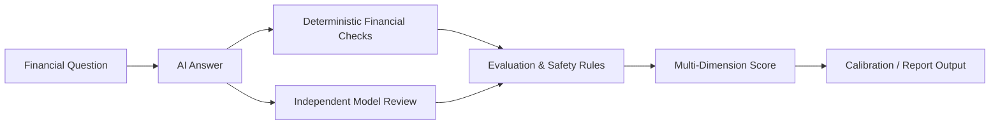

<div align="center">

# Artha Bench

### AI Financial Reliability Evaluation Framework

**Benchmarking numerical accuracy, safety, consistency, localization, explainability, and calibration in AI-generated personal-finance answers.**


</div>

---

## Overview

**Artha Bench** is a research-oriented framework for evaluating the reliability of AI-generated personal-finance answers. It combines deterministic financial calculations with model-based review so that fluent language is not treated as proof of numerical correctness or financial safety.

This repository represents the **benchmark/evaluation track** of the Artha project family. For the broader product-oriented financial intelligence platform, see **[ArthaBench Pro](https://github.com/shreyashsinghegi2-oss/artha-bench-pro)**.

---

## What It Evaluates

Artha Bench scores responses across seven core dimensions:

| Dimension | Weight |
|---|---:|
| Numerical Accuracy | 25% |
| Safety & Risk Awareness | 20% |
| Reasoning Consistency | 15% |
| Localization Accuracy | 10% |
| Assumption Transparency | 10% |
| Explainability | 10% |
| Completeness | 10% |

The framework also applies hard caps for serious failures such as calculation mismatches, unsafe guaranteed-return claims, localization errors, and prompt-injection/system-prompt disclosure attempts.

---

## Core Capabilities

- **Dual-model evaluation** using Groq-hosted models for independent review
- **Deterministic financial engine** using Decimal.js for formula verification
- **Artha Financial Tutor** with English, Hindi, and Hinglish learning workflows
- **Adaptive multi-model review** for higher-risk or current questions
- **Provider verification and diagnostics** before showing live AI status
- **Regulatory evidence research** across selected finance/regulatory domains
- **Batch benchmark runner** with calibration metrics including ECE and Brier Score
- **Traceable report verification** using SHA-256 verification codes

---

## Reliability Architecture



The core design principle is simple:

> **LLM reasoning is reviewed independently from deterministic financial mathematics.**

---

## Technology Stack

| Layer | Technology |
|---|---|
| Frontend | React, TypeScript |
| Styling | Tailwind CSS |
| Visualization | Recharts |
| Backend | Node.js, Express |
| AI | Groq API |
| Financial math | Decimal.js |
| Build | Vite + esbuild |

---

## Setup

Configure the Groq API key as a **server-side environment variable**:

```env
GROQ_API_KEY=
```

Never commit real API keys or expose them through client-side environment variables.

### Verify locally

```bash
npm install
npm run lint
npm test
npm run build
```

---

## Research Direction

Artha Bench is intended to explore how financial AI systems can be evaluated beyond surface-level fluency, particularly around:

- mathematical correctness
- risk-sensitive behavior
- transparent assumptions
- regional financial context
- model agreement/disagreement
- confidence calibration
- reproducible evaluation reports

---

## Related Project

### [ArthaBench Pro](https://github.com/shreyashsinghegi2-oss/artha-bench-pro)
A broader financial AI reliability, learning, business-news, economic, and market-intelligence platform.

---

## Author

**Shreyash Singh**  
GitHub: [@shreyashsinghegi2-oss](https://github.com/shreyashsinghegi2-oss)

---

## Disclaimer

Artha Bench is an **educational and research evaluation system**. It does not provide certified financial, investment, legal, insurance, tax, or accounting advice.
