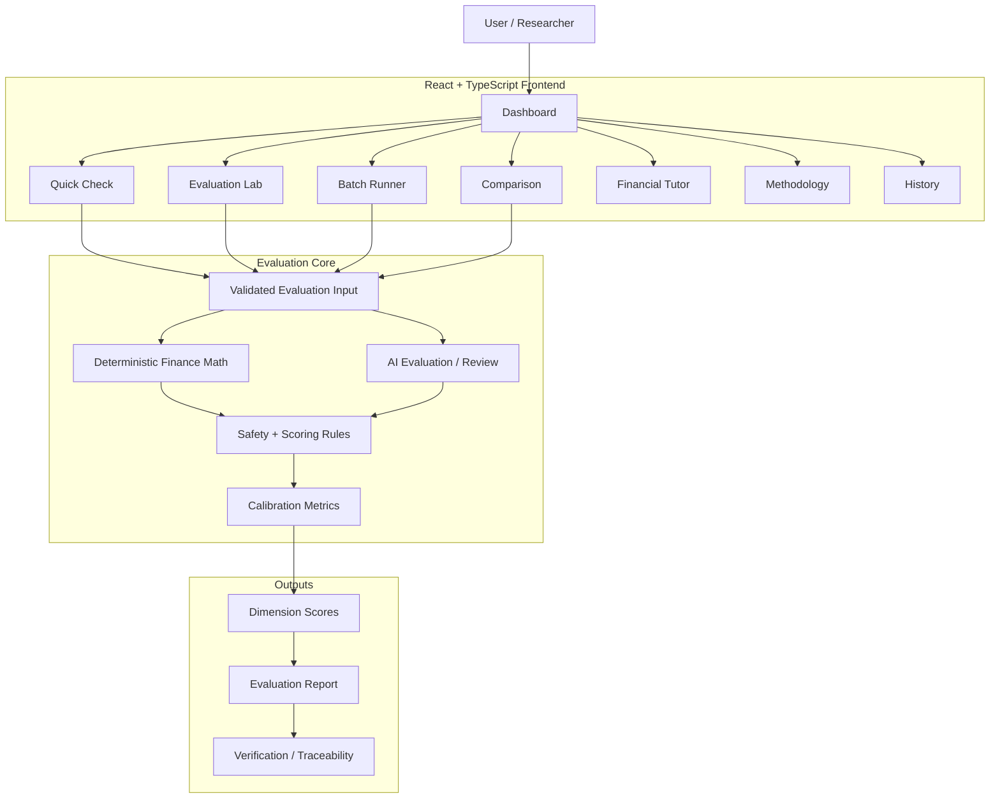
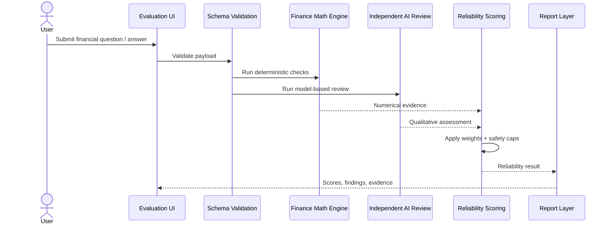
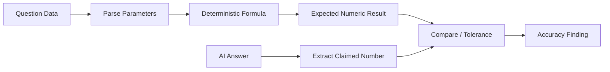
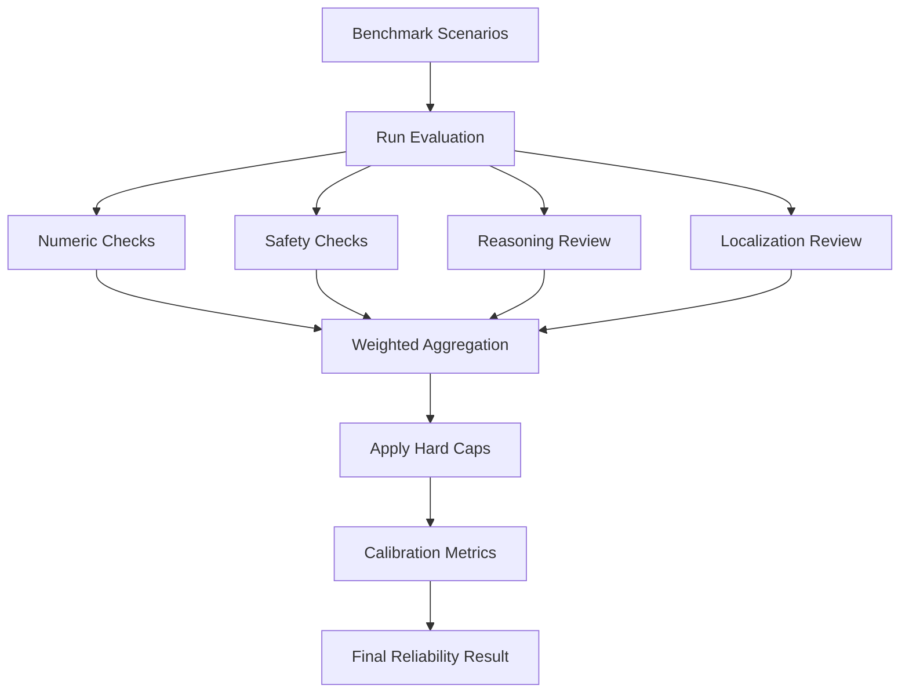
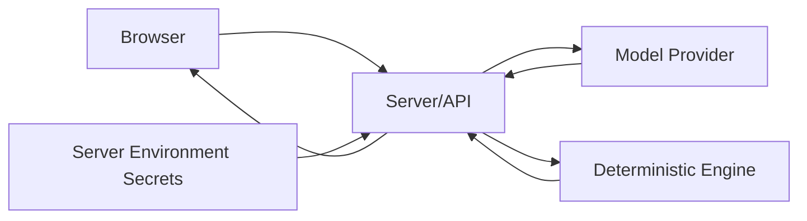
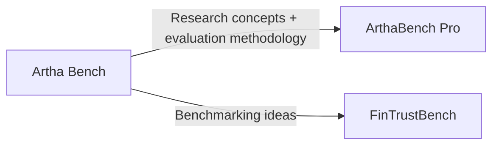

# Artha Bench — Research & Architecture Wiki

> **Purpose:** Technical documentation for the research-oriented AI financial reliability benchmark.

## 1. Overview

Artha Bench evaluates AI-generated personal-finance answers across numerical accuracy, safety, reasoning consistency, localization, transparency, explainability, and completeness. It is designed as a benchmark/research system rather than a general financial dashboard.

## 2. System Architecture



## 3. Evaluation Lifecycle



## 4. Evaluation Dimensions

| Dimension | Weight |
|---|---:|
| Numerical Accuracy | 25% |
| Safety & Risk Awareness | 20% |
| Reasoning Consistency | 15% |
| Localization Accuracy | 10% |
| Assumption Transparency | 10% |
| Explainability | 10% |
| Completeness | 10% |

Hard caps are applied for severe failures such as unsafe guaranteed-return language, numerical mismatches, localization failure, or prompt-injection/system-prompt disclosure behavior.

## 5. Deterministic Financial Engine

The project contains a dedicated engine at `src/engine/financeMath.ts` for financial calculations. This prevents the benchmark from using an LLM as the source of truth for mathematical validation.



## 6. Major UI Areas

| Page | Role |
|---|---|
| `DashboardPage.tsx` | High-level benchmark overview |
| `QuickCheckPage.tsx` | Fast single-response reliability evaluation |
| `EvaluationLabPage.tsx` | Detailed evaluation workflow |
| `BatchPage.tsx` | Multi-item benchmark execution |
| `ComparisonPage.tsx` | Compare model/answer performance |
| `TutorPage.tsx` | Multilingual financial tutoring |
| `MethodologyPage.tsx` | Explain benchmark methodology |
| `ScenariosPage.tsx` | Curated benchmark scenarios |
| `HistoryPage.tsx` | Stored evaluation history |
| `ConnectionsPage.tsx` | Provider/model connectivity |

## 7. Research Flow



## 8. Calibration

Batch evaluation includes calibration-oriented metrics such as Expected Calibration Error (ECE) and Brier Score. These help measure whether confidence aligns with observed correctness rather than only ranking answer quality.

## 9. Security Model



Provider credentials should remain server-side and never appear in committed code or browser responses.

## 10. Repository Structure

```text
artha-bench/
├── src/
│   ├── components/
│   ├── data/
│   ├── engine/
│   │   └── financeMath.ts
│   ├── pages/
│   │   ├── DashboardPage.tsx
│   │   ├── QuickCheckPage.tsx
│   │   ├── EvaluationLabPage.tsx
│   │   ├── BatchPage.tsx
│   │   ├── ComparisonPage.tsx
│   │   ├── TutorPage.tsx
│   │   └── MethodologyPage.tsx
│   ├── schemas/
│   └── types.ts
└── README.md
```

## 11. Position in the Project Family



- **Artha Bench:** benchmark methodology and financial-AI reliability research
- **ArthaBench Pro:** broader product platform built around reliability-aware financial intelligence
- **FinTrustBench:** trustworthy personal-finance benchmarking and model comparison

## 12. Research Roadmap

- Larger benchmark scenario library
- Stronger ground-truth datasets
- Reproducible benchmark exports
- Model-to-model comparison experiments
- Better confidence calibration analysis
- Regulatory/localization test suites
- Citation-grounded evaluation for financial documents

## 13. Design Philosophy

> A finance benchmark should reward correctness and safety, not merely persuasive language.
